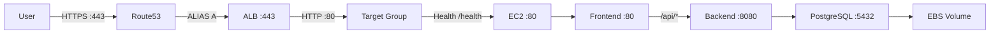
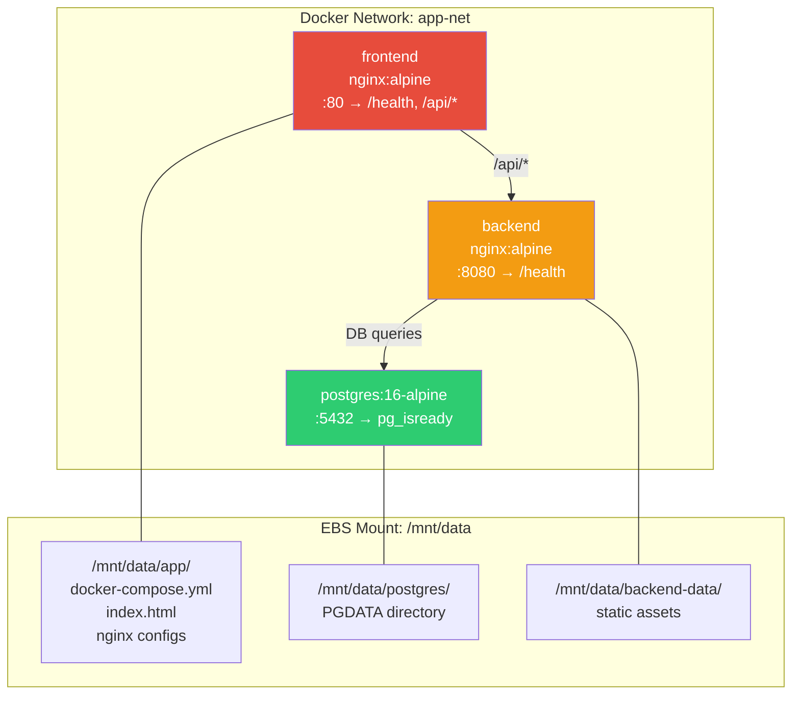
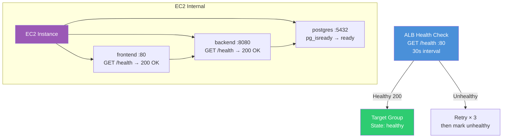

# Architecture

## AWS Infrastructure Overview

```
                              ┌─────────────────────┐
                              │     Internet         │
                              └──────────┬──────────┘
                                         │
                    ┌────────────────────┼────────────────────┐
                    │                    │                    │
               HTTPS :443           HTTP :80             SSH :22
                    │                    │                    │
                    │            ┌───────┘                    │
                    │            │                            │
              ┌─────▼────────────▼──┐                  ┌──────▼──────┐
              │    Route53          │                  │  Elastic IP │
              │    ALIAS A Record   │                  │  (optional) │
              │    customer.domain  │                  └─────────────┘
              └─────────┬───────────┘
                        │
              ┌─────────▼───────────┐
              │  ACM Certificate    │
              │  DNS-validated      │
              │  *.domain.com       │
              │  Auto-renewed       │
              └─────────┬───────────┘
                        │
              ┌─────────▼───────────┐
              │  ALB Security Group │
              │  Inbound:           │
              │    Port 80  (0.0.0.0)│
              │    Port 443 (0.0.0.0)│
              └─────────┬───────────┘
                        │
              ┌─────────▼───────────┐
              │  Application Load   │
              │  Balancer (ALB)     │
              │                     │
              │  Listener :80       │
              │    → 301 redirect   │
              │      to HTTPS       │
              │  Listener :443      │
              │    → Forward to TG  │
              └─────────┬───────────┘
                        │
              ┌─────────▼───────────┐
              │  Target Group       │
              │  Protocol: HTTP:80  │
              │  Health: /health    │
              │  Matcher: 200-399   │
              │  Interval: 30s      │
              └─────────┬───────────┘
                        │
              ┌─────────▼───────────┐
              │  EC2 Security Group │
              │  Inbound:           │
              │    Port 22  (SSH)   │
              │    Port 80  (ALB SG)│
              │    Port 8080 (app)  │
              └─────────┬───────────┘
                        │
              ┌─────────▼───────────┐
              │  EC2 Instance       │
              │  Amazon Linux 2023  │
              │  t3.small / medium  │
              │  IMDSv2 enforced    │
              │  IAM Instance Prof. │
              └─────────┬───────────┘
                        │
              ┌─────────▼───────────┐
              │  Docker Compose     │
              │  (3 containers)     │
              │                     │
              │  ┌─────────────────┐│
              │  │ frontend        ││
              │  │ nginx:alpine    ││
              │  │ Port 80         ││
              │  │ /api/ → backend ││
              │  └──────┬──────────┘│
              │         │           │
              │  ┌──────▼──────────┐│
              │  │ backend         ││
              │  │ nginx:alpine    ││
              │  │ Port 8080       ││
              │  │ /health → 200   ││
              │  └──────┬──────────┘│
              │         │           │
              │  ┌──────▼──────────┐│
              │  │ postgres:16     ││
              │  │ Alpine          ││
              │  │ Port 5432       ││
              │  │ pg_isready      ││
              │  └─────────────────┘│
              └─────────┬───────────┘
                        │
              ┌─────────▼───────────┐
              │  EBS Volume (gp3)   │
              │  Encrypted at rest   │
              │  /dev/sdf           │
              │  Mount: /mnt/data   │
              │  30GB / 50GB        │
              │  xfs filesystem     │
              └─────────────────────┘
```

## Data Flow

```
                    REQUEST FLOW
  ─────────────────────────────────────

  1. User → https://customer.example.com
  2. Route53 ALIAS resolves → ALB DNS name
  3. ALB Listener :443 terminates TLS
  4. ALB forwards HTTP:80 to Target Group
  5. Target Group routes to EC2 instance
  6. EC2 SG allows only ALB SG on port 80
  7. Docker frontend (nginx:80) receives request
  8. /api/* proxied to backend (nginx:8080)
  9. Backend queries PostgreSQL (Docker net)
  10. PostgreSQL reads/writes EBS volume

  HTTP :80 requests are 301 redirected to HTTPS
```

## VPC Networking

| Component | Detail |
|-----------|--------|
| **VPC** | Default VPC in the AWS account |
| **Subnets** | All public subnets across all AZs (auto-discovered) |
| **Subnet selection** | Deterministic `one()` — exactly 1 subnet in target AZ |
| **Internet Gateway** | Attached to default VPC (default) |
| **Route tables** | Default route table (0.0.0.0/0 → IGW) |

## Security Groups

### ALB Security Group

| Direction | Protocol | Port | Source | Purpose |
|-----------|----------|------|--------|---------|
| Inbound | TCP | 80 | 0.0.0.0/0 | HTTP traffic |
| Inbound | TCP | 443 | 0.0.0.0/0 | HTTPS traffic |
| Outbound | All | All | 0.0.0.0/0 | Default egress |

### EC2 Security Group

| Direction | Protocol | Port | Source | Purpose |
|-----------|----------|------|--------|---------|
| Inbound | TCP | 22 | Varies | SSH (staging: 0.0.0.0/0, prod: restricted) |
| Inbound | TCP | 80 | ALB SG | ALB to EC2 traffic |
| Inbound | TCP | 8080 | EC2 SG | Internal app traffic |
| Outbound | All | All | 0.0.0.0/0 | Default egress |

## ALB → Target Group → EC2 Flow



1. **ALB Listener (443)**: Terminates TLS using ACM certificate. Forwards to target group.
2. **ALB Listener (80)**: Returns HTTP 301 redirect to `https://$host$request_uri`.
3. **Target Group**: Routes to EC2 instance port 80. Health check: `GET /health`, interval 30s, threshold 3.
4. **EC2**: Amazon Linux 2023 running Docker Compose. Port 80 restricted to ALB SG only.

## Docker Compose Architecture



### Container Details

| Container | Image | Port | Health Check | Depends On |
|-----------|-------|------|-------------|------------|
| **frontend** | nginx:alpine | 80 → 80 | `/health` → 200 | backend |
| **backend** | nginx:alpine | 8080 → 80 | `/health` → 200 | postgres |
| **postgres** | postgres:16-alpine | 5432 | `pg_isready` | - |

## EBS Usage

| Property | Staging | Production |
|----------|---------|------------|
| **Device** | `/dev/sdf` | `/dev/sdf` |
| **Size** | 30 GB gp3 | 50 GB gp3 |
| **Encryption** | Enabled | Enabled |
| **Filesystem** | xfs | xfs |
| **Mount point** | `/mnt/data` | `/mnt/data` |
| **Format on first boot** | `mkfs -t xfs /dev/sdf` | `mkfs -t xfs /dev/sdf` |
| **Preserved after destroy** | No (`skip_destroy=false`) | Yes (`skip_destroy=true`) |

## Health Check Flow



### Health Check Strategy

| Layer | Check | Frequency | Timeout | Thresholds |
|-------|-------|-----------|---------|------------|
| **ALB → EC2** | `GET /health` → 200 | 30s | 5s | 3 healthy / 3 unhealthy |
| **Docker** | Container health checks | 10s | 5s | 3 healthy / 3 unhealthy |
| **frontend** | `curl localhost/health` | - | - | Manual verification |
| **backend** | `curl localhost:8080/health` | - | - | Manual verification |

## Security Boundaries

| Layer | Control |
|-------|---------|
| **TLS** | ACM certificate via DNS validation, TLS 1.2+ (TLS13-1-2-2021-06 policy) |
| **Network** | EC2 SG allows port 80 only from ALB SG (no direct HTTP to EC2) |
| **IAM** | SSM agent + EBS attach/detach scoped to AZ + account |
| **Instance Metadata** | IMDSv2 enforced (`http_tokens = "required"`) |
| **Storage** | EBS encrypted at rest (`encrypted = true`) |
| **Application** | Health check endpoints, structured logging, non-root containers |
| **Destruction** | Production volumes protected (`skip_destroy = true`) |
