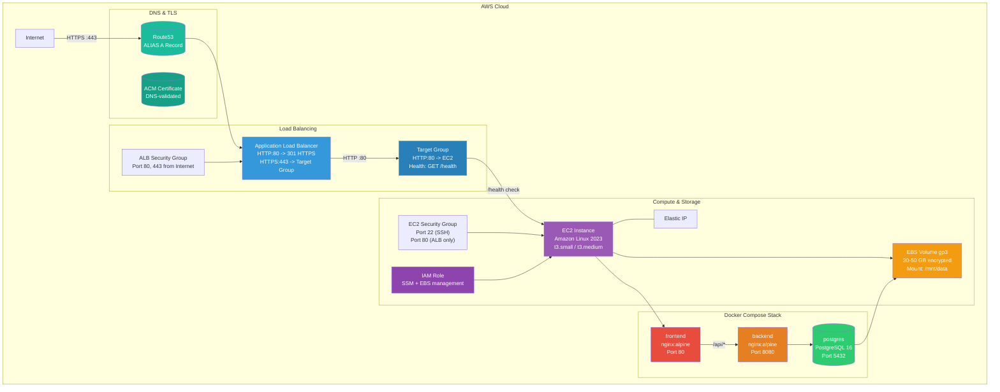
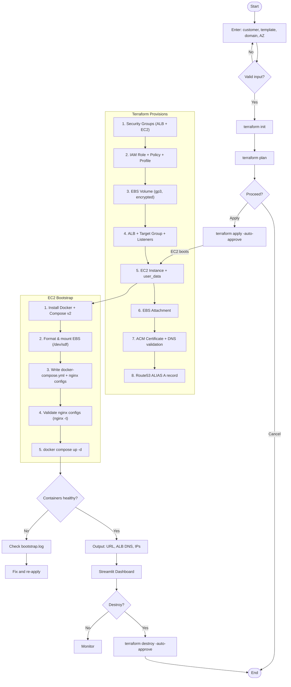
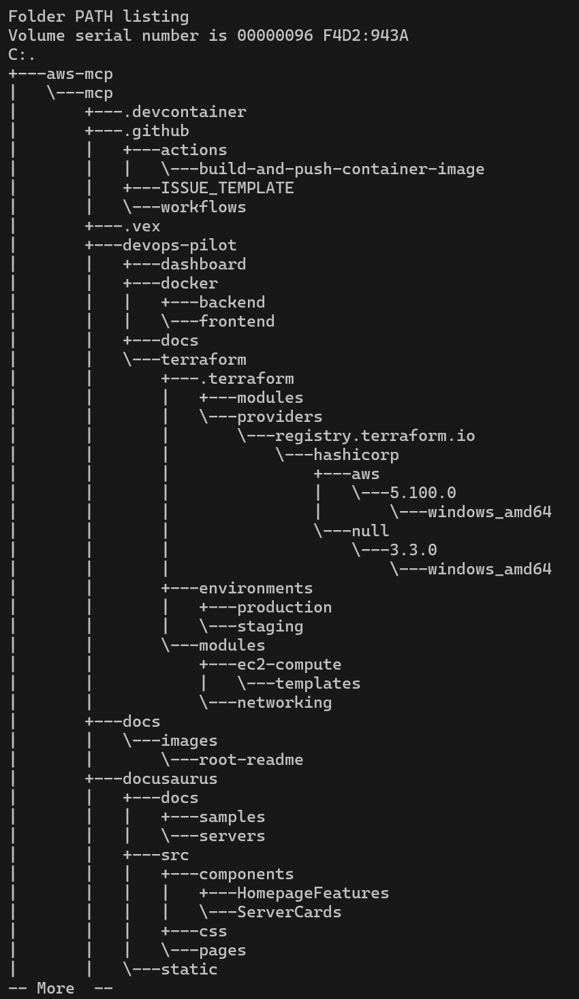

# DevOps Pilot

Automated AWS infrastructure deployment with Terraform, Docker Compose, and Application Load Balancer.

## Assignment Overview

This project demonstrates a complete DevOps workflow: provisioning a production-ready three-tier web application stack on AWS using Infrastructure-as-Code. A single `terraform apply` creates DNS resolution (Route53), TLS termination (ACM), load balancing (ALB), compute (EC2), container orchestration (Docker Compose), and persistent storage (EBS). A Streamlit dashboard provides self-service deployment capabilities.

**Key deliverables:**
- Fully automated infrastructure deployment (15+ AWS resources)
- Reproducible via CLI (`terraform apply`) or UI (Streamlit dashboard)
- Dual-environment support (staging / production) with environment-specific configs
- TLS termination with ACM and HTTP→HTTPS redirect
- Deterministic subnet selection with validation at plan-time
- Comprehensive bootstrap script with retry logic, health checks, and nginx validation

## Architecture



## Infrastructure Components

| Component | Type | Detail |
|-----------|------|--------|
| **Route53** | DNS | ALIAS A record -> ALB DNS name. DNS validation records for ACM. |
| **ACM** | TLS | Public certificate for `customer.domain` + `*.customer.domain`. Auto-renewed. |
| **ALB** | Load Balancer | Dual listeners: `:80` (301 redirect to HTTPS), `:443` (forward to target group). |
| **Target Group** | Routing | Routes to EC2 instance port 80. Health check: `GET /health`, interval 30s. |
| **Security Groups** | Firewall | ALB SG (80,443 from 0.0.0.0/0). EC2 SG (22 from SSH CIDR, 80 from ALB SG). |
| **EC2** | Compute | Amazon Linux 2023. IMDSv2 enforced. CloudWatch monitoring enabled. |
| **IAM Role** | Access | SSM ManagedInstance + EBS attach/detach (scoped to AZ + account). |
| **EBS** | Storage | gp3 encrypted volume. 30GB (staging) / 50GB (production). xfs filesystem. |
| **Docker Compose** | Orchestration | Three containers: frontend (nginx:80), backend (nginx:8080), PostgreSQL 16. |
| **Elastic IP** | Networking | Static public IP for SSH/administration. |

## Repository Structure

```
devops-pilot/
├── terraform/                      # Infrastructure-as-Code (Terraform)
│   ├── main.tf                     # Root module: provider, data sources, ACM, ALB, Route53
│   ├── variables.tf                # Input variables with validation rules
│   ├── outputs.tf                  # Deployment outputs (URL, DNS, IDs)
│   ├── modules/
│   │   ├── ec2-compute/            # EC2, EBS, IAM role, user_data bootstrap
│   │   │   └── templates/
│   │   │       └── user_data.sh    # Bootstrap script (Docker, compose, nginx)
│   │   └── networking/             # Security groups, ALB ingress rules
│   └── environments/
│       ├── staging/                # t3.small, 30GB EBS, open SSH, ~$52/mo
│       └── production/            # t3.medium, 50GB EBS, restricted SSH, ~$94/mo
├── docker/                         # Local Docker Compose development
│   ├── compose.yml                 # Three-service stack
│   ├── frontend/                   # Frontend nginx config
│   └── backend/                    # Backend nginx config
├── dashboard/                      # Streamlit self-service deployment UI
│   ├── app.py                      # Deploy/destroy automation
│   └── requirements.txt            # Python dependencies
├── docs/
│   ├── architecture.md             # ASCII architecture diagram
│   └── workflow.md                 # Deployment workflow documentation
├── screenshots/                    # Deployment evidence (see below)
├── ARCHITECTURE.md                 # Full architecture documentation with Mermaid diagrams
├── COST_ESTIMATE.md                # Monthly cost breakdown
├── DEMO.md                         # Step-by-step reviewer walkthrough
└── README.md                       # This file
```

## Prerequisites

- **Terraform** >= 1.0 ([install guide](https://developer.hashicorp.com/terraform/downloads))
- **AWS account** with credentials configured (environment variables or `~/.aws/credentials`)
- **Route53 hosted zone** for your domain (e.g. `example.com`)
- **Docker** for local testing ([install guide](https://docs.docker.com/engine/install/))
- **Python** >= 3.9 for the Streamlit dashboard

## Deployment Workflow



## Validation Process

### Terraform Validation

```bash
cd terraform

# Step 1: Initialize providers and modules
terraform init

# Step 2: Validate configuration syntax and logic
terraform validate
# Expected: Success! The configuration is valid.

# Step 3: Review execution plan (dry run)
terraform plan -var="customer=demo" ^
  -var="environment=staging" ^
  -var="root_domain=demo.example.com" ^
  -var="availability_zone=us-east-1a" ^
  -var="create_dns_resources=false"
# Expected: Plan: 15 to add, 0 to change, 0 to destroy.

# Step 4: Apply (with DNS disabled for testing)
terraform apply -var="customer=demo" ^
  -var="environment=staging" ^
  -var="root_domain=demo.example.com" ^
  -var="availability_zone=us-east-1a" ^
  -var="create_dns_resources=false" ^
  -auto-approve
# Expected: Apply complete! Resources: 15 added.
```

### Infrastructure Validation

```bash
# Get deployment outputs
terraform output website_url
# http://demo-alb-123456.us-east-1.elb.amazonaws.com

terraform output alb_dns_name
# demo-alb-123456.us-east-1.elb.amazonaws.com

terraform output elastic_ip
# 54.123.45.67

terraform output instance_id
# i-0abc123def456

# Verify EC2 is running
aws ec2 describe-instances --instance-ids $(terraform output -raw instance_id) ^
  --query "Reservations[0].Instances[0].State.Name"
# running

# Verify ALB target group health
aws elbv2 describe-target-health ^
  --target-group-arn $(terraform output -raw alb_target_group_arn) ^
  --query "TargetHealthDescriptions[0].TargetHealth.State"
# healthy
```

### Application Validation

```bash
# ALB health endpoint
curl -s http://$(terraform output -raw alb_dns_name)/health
# healthy

# SSH into EC2
ssh -i your-key.pem ec2-user@$(terraform output -raw elastic_ip)

# Inside EC2 - Docker containers
docker compose ps
# NAME                    STATUS         PORTS
# demo-staging-postgres   Up (healthy)   5432/tcp
# demo-staging-backend    Up (healthy)   80/tcp
# demo-staging-frontend   Up (healthy)   0.0.0.0:80->80/tcp

# Inside EC2 - health endpoints
curl -s http://localhost/health
# healthy

curl -s http://localhost:8080/health
# healthy

# Inside EC2 - bootstrap log
sudo cat /var/log/bootstrap.log | tail -15
# [SUCCESS] Bootstrap completed successfully
```

## Deployment Evidence

All screenshots below are from a successful live deployment on AWS. Click thumbnails to enlarge.

### Terraform Apply Success


Terraform apply completed successfully: 15 resources added, 0 destroyed. Outputs show the ALB DNS name, Elastic IP, instance ID, and website URL.

### EC2 Instance Running


EC2 instance in `running` state with the tag `Customer=demo`. Instance type `t3.small` launched in `us-east-1a` with the associated Elastic IP.

### Load Balancer


ALB configured with two listeners: HTTP:80 (redirecting to HTTPS) and HTTPS:443 (forwarding to target group). DNS name shown along with the ALB security group.

### Target Group Healthy


Target group shows the registered EC2 instance with `healthy` status. Health check configuration: `GET /health` on port 80, 30-second interval, 5-second timeout.

### Health Endpoint


ALB DNS name serving the `/health` endpoint returning `healthy`. This confirms the full chain: ALB -> Target Group -> EC2 -> Docker -> backend container.

### SSM Session Manager


SSM Session Manager connected to the EC2 instance. The IAM role provides `AmazonSSMManagedInstanceCore` policy, enabling browser-based shell access without SSH keys.

### EBS Mounted


EBS volume (`/dev/sdf`) mounted at `/mnt/data`. Output from `df -h` shows the 30GB volume available. Filesystem is xfs, formatted on first boot.

### Health Checks Locally


Local health checks inside the EC2 instance: `curl localhost/health` returns `healthy` and `curl localhost:8080/health` returns `healthy`. Both frontend and backend containers respond correctly.

### Bootstrap Completion


Bootstrap log showing all 10 steps completed successfully. Steps include: Docker install, Compose install, EBS format/mount, nginx config validation, and `docker compose up -d`.

### Repository Structure



Complete project structure showing all directories and files. Terraform modules, Docker configs, dashboard, documentation, and screenshots are organized cleanly.

### Terraform Module Structure


Terraform module tree showing the `ec2-compute` and `networking` modules with their `main.tf`, `variables.tf`, `outputs.tf`, and `templates/` subdirectory.

## How to Reproduce the Demo

### One-Command Deployment

```powershell
cd terraform

terraform init && `
terraform apply -var="customer=demo" ^
  -var="environment=staging" ^
  -var="root_domain=demo.example.com" ^
  -var="availability_zone=us-east-1a" ^
  -var="create_dns_resources=false" ^
  -auto-approve
```

### What Gets Deployed (15 Resources)

| # | Resource | Detail |
|---|----------|--------|
| 1 | `aws_security_group.alb` | ALB SG - ports 80, 443 |
| 2 | `aws_security_group.ec2` | EC2 SG - ports 22, 80(ALB), 8080 |
| 3 | `aws_security_group_rule.alb_ingress_http` | ALB ingress rule |
| 4 | `aws_security_group_rule.alb_ingress_https` | ALB ingress rule |
| 5 | `aws_iam_role.ec2_role` | EC2 IAM role |
| 6 | `aws_iam_role_policy_attachment.ssm` | SSM policy attach |
| 7 | `aws_iam_instance_profile.ec2` | Instance profile |
| 8 | `aws_ebs_volume.data` | EBS gp3 volume |
| 9 | `aws_instance.app` | EC2 with user_data |
| 10 | `aws_volume_attachment.data` | EBS attachment |
| 11 | `aws_eip.app` | Elastic IP |
| 12 | `aws_eip_association.app` | EIP association |
| 13 | `aws_lb.alb` | ALB |
| 14 | `aws_lb_target_group.app` | Target group |
| 15 | `aws_lb_listener.http` | HTTP listener (301 redirect) |

With DNS enabled, 2 additional resources: `aws_acm_certificate` + `aws_route53_record`.

### Post-Deployment Verification

```bash
# 1. ALB is serving traffic
curl -s http://$(terraform output -raw alb_dns_name)/health
# healthy

# 2. SSH into EC2
ssh -i ~/.ssh/id_rsa ec2-user@$(terraform output -raw elastic_ip)

# 3. Check containers
docker compose ps

# 4. Check health inside EC2
curl -s localhost/health && curl -s localhost:8080/health

# 5. View bootstrap log
sudo cat /var/log/bootstrap.log

# 6. Verify EBS mount
df -h /mnt/data
```

### Clean Up

```bash
terraform destroy -var="customer=demo" ^
  -var="environment=staging" ^
  -var="root_domain=demo.example.com" ^
  -var="availability_zone=us-east-1a" ^
  -var="create_dns_resources=false" ^
  -auto-approve
```

## Clean Up

```bash
cd terraform
terraform destroy -var="customer=demo" ^
  -var="environment=staging" ^
  -var="root_domain=example.com" ^
  -var="availability_zone=us-east-1a"
```

Or use the Streamlit dashboard with the **Destroy** action.

## Environments

| Property | Staging | Production |
|----------|---------|------------|
| Instance | t3.small (2 vCPU, 2 GiB) | t3.medium (2 vCPU, 4 GiB) |
| Root volume | 20 GB gp3 | 30 GB gp3 |
| Data volume | 30 GB gp3 | 50 GB gp3 |
| SSH access | 0.0.0.0/0 | Restricted CIDRs |
| ALB deletion protection | Off | On |
| EBS skip_destroy | false | true |
| Monthly cost | ~$52 | ~$94 |

## Cost Estimate

See [COST_ESTIMATE.md](COST_ESTIMATE.md) for a full breakdown.

| Environment | Monthly Cost | Main Cost Drivers |
|-------------|-------------|-------------------|
| Staging | ~$52/mo | t3.small ($20.52) + ALB ($22.28) + EBS ($4.00) |
| Production | ~$94/mo | t3.medium ($41.04) + ALB ($28.13) + EBS ($6.40) |
