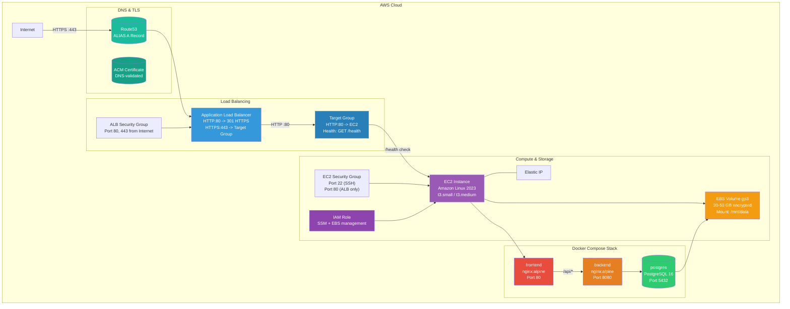
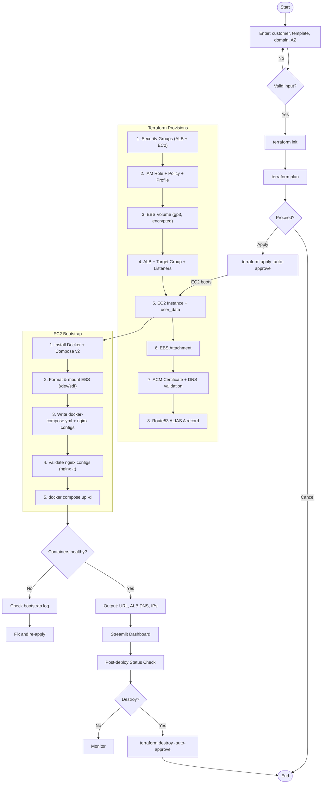
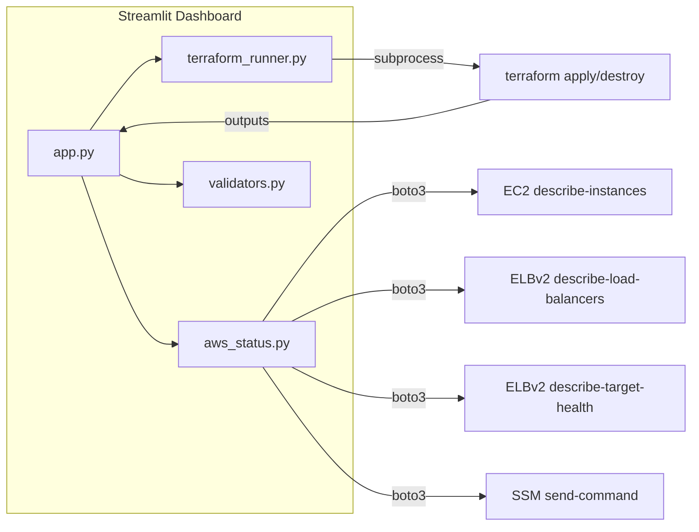

# DevOps Pilot

Automated AWS infrastructure deployment with Terraform, Docker Compose, and Application Load Balancer.

## Architecture



## Deployment Flow



## Project Structure

```
devops-pilot/
├── terraform/
│   ├── main.tf                     # Root module: provider, data sources, ALB, EIP, target group
│   ├── variables.tf                # Input variables with validation
│   ├── outputs.tf                  # Deployment outputs
│   ├── route53.tf                  # Route53 zone, ACM cert, DNS validation records
│   ├── modules/
│   │   ├── ec2-compute/            # EC2, EBS, IAM role, user_data bootstrap
│   │   │   └── templates/
│   │   │       └── user_data.sh    # Bootstrap script
│   │   └── networking/             # Security group, ALB ingress rule
│   └── environments/
│       ├── staging/                # t3.small, 30GB EBS, open SSH
│       └── production/            # t3.medium, 50GB EBS, restricted SSH
├── docker/                         # Local Docker Compose development
│   ├── compose.yml
│   ├── frontend/
│   └── backend/
├── dashboard/
│   ├── app.py                      # Streamlit deployment UI
│   ├── terraform_runner.py         # Terraform execution engine
│   ├── aws_status.py               # AWS post-deployment health checks
│   ├── validators.py               # Input validation
│   └── requirements.txt
├── screenshots/                    # Deployment evidence
├── ARCHITECTURE.md                 # Full architecture documentation
├── COST_ESTIMATE.md                # Monthly cost breakdown
├── DEMO.md                         # Step-by-step reviewer walkthrough
└── README.md                       # This file
```

## Prerequisites

- **Terraform** >= 1.0
- **AWS account** with credentials configured (env vars or `~/.aws/credentials`)
- **Route53 hosted zone** for your domain (e.g. `demo.example.com`)
- **Python** >= 3.9 for the Streamlit dashboard

## Quick Start

```bash
# 1. Install Python dependencies
pip install -r dashboard/requirements.txt

# 2. Launch the dashboard
streamlit run dashboard/app.py

# 3. Open the URL shown in terminal
```

## Dashboard Features

The dashboard provides a complete self-service deployment interface:

### Deployment Page
- **Customer Name**: Enter any name (e.g., `ibm`, `nike`, `acme`)
- **Environment**: Select `staging` or `production`
- **Root Domain**: Your Route53 domain (or `demo.example.com` for testing)
- **Availability Zone**: Target AZ (e.g., `us-east-1a`)

### Deploy Button
1. Validates customer name format
2. Runs `terraform init` + `terraform plan` + `terraform apply -auto-approve`
3. Streams live logs to the deployment log panel
4. Parses Terraform outputs
5. Displays: Customer URL, EC2 ID, ALB DNS, Elastic IP, EBS Volume ID

### Destroy Button
1. Runs `terraform destroy -auto-approve`
2. Streams live logs
3. Shows completion status

### Status Dashboard
Post-deployment health checks:
- EC2 instance state (`running` / `stopped`)
- ALB state (`active` / `provisioning`)
- Target Group health (`healthy` / `unhealthy`)
- Container health (via SSM: frontend + backend health endpoints)

### Post-Deployment Validation
After deployment, the dashboard automatically:
1. Checks EC2 instance is `running`
2. Verifies ALB is `active`
3. Confirms target group is `healthy`
4. Runs SSM commands to verify Docker containers respond on `/health`

## Dashboard Architecture



## Example Customer Deployment

### Deploy "ibm" on staging

```bash
cd terraform

terraform init

terraform apply -var="customer_name=ibm" \
  -var="environment=staging" \
  -var="root_domain=demo.example.com" \
  -var="availability_zone=us-east-1a" \
  -var="create_dns_resources=false" \
  -auto-approve
```

Resources created:
| Resource | Name |
|----------|------|
| ALB Security Group | `ibm-staging-alb-sg` |
| EC2 Security Group | `ibm-staging-sg` |
| IAM Role | `ibm-staging-ec2-role` |
| IAM Instance Profile | `ibm-staging-instance-profile` |
| EBS Volume | `ibm-staging-data` |
| EC2 Instance | `ibm-staging-app` |
| Elastic IP | `ibm-staging-eip` |
| Target Group | `ibm-staging-tg` |
| ALB | `ibm-staging-alb` |

### Deploy "nike" on production

```bash
terraform apply -var="customer_name=nike" \
  -var="environment=production" \
  -var="root_domain=demo.example.com" \
  -var="availability_zone=us-east-1a" \
  -var="create_dns_resources=false" \
  -auto-approve
```

### Verify Deployment

```bash
# Get deployment outputs
terraform output customer_url
# http://nike-alb-123456.us-east-1.elb.amazonaws.com

terraform output instance_id
# i-0abc123def456

# Check EC2 status
aws ec2 describe-instances --instance-ids $(terraform output -raw instance_id)

# Check target group health
aws elbv2 describe-target-health \
  --target-group-arn $(terraform output -raw alb_target_group_arn)

# Test ALB endpoint
curl -s http://$(terraform output -raw alb_dns_name)/health
# healthy
```

## Route53 Setup Instructions

### With a Real Domain

1. Create a Route53 hosted zone (e.g., `demo.example.com`)
2. Update your registrar's nameservers to Route53
3. Deploy with `create_dns_resources=true` (default):

```bash
terraform apply -var="customer_name=acme" \
  -var="environment=staging" \
  -var="root_domain=demo.example.com" \
  -var="availability_zone=us-east-1a"
```

This creates:
- ACM certificate for `acme.demo.example.com` + `*.demo.example.com`
- DNS validation records in Route53
- Route53 ALIAS A record pointing to ALB
- HTTPS listener with HTTP→HTTPS redirect

### Without a Domain (Testing)

```bash
terraform apply -var="customer_name=acme" \
  -var="environment=staging" \
  -var="root_domain=demo.example.com" \
  -var="availability_zone=us-east-1a" \
  -var="create_dns_resources=false"
```

This creates HTTP-only deployment. Use ALB DNS name for access.

## Terraform Usage

### Variables

| Variable | Type | Default | Description |
|----------|------|---------|-------------|
| `customer_name` | string | - | Customer name (lowercase alphanumeric with hyphens) |
| `environment` | string | - | `staging` or `production` |
| `root_domain` | string | - | Root DNS domain |
| `availability_zone` | string | - | AZ for EC2 and EBS |
| `create_dns_resources` | bool | `true` | Create Route53/ACM/HTTPS |
| `app_port` | number | `8080` | Backend container port |
| `ssh_cidr_blocks` | list(string) | `["0.0.0.0/0"]` | SSH allowed CIDRs |
| `db_password` | string | `""` (auto-generated) | PostgreSQL password |

### Outputs

| Output | Description |
|--------|-------------|
| `customer_name` | Customer name used |
| `customer_url` | Customer-facing URL |
| `environment` | Deployment environment |
| `instance_id` | EC2 instance ID |
| `alb_dns_name` | ALB DNS name |
| `elastic_ip` | Elastic IP |
| `ebs_volume_id` | EBS volume ID |
| `security_group_name` | EC2 security group |
| `alb_target_group_arn` | Target group ARN |

## Demo Walkthrough

### 1. Launch Dashboard

```bash
pip install -r dashboard/requirements.txt
streamlit run dashboard/app.py
```

### 2. Deploy a Customer

1. Enter customer name: `ibm`
2. Select environment: `staging`
3. Enter root domain: `demo.example.com`
4. Enter AZ: `us-east-1a`
5. Click **Deploy**

### 3. Monitor Deployment

Watch live Terraform logs in the deployment log panel.

### 4. View Outputs

After deployment, the outputs panel shows:
- Customer URL: `http://ibm-alb-123456.us-east-1.elb.amazonaws.com`
- EC2 Instance ID
- ALB DNS Name
- Elastic IP
- EBS Volume ID

### 5. Check Status

Switch to the **Status Dashboard** tab to see:
- EC2: Healthy ✅
- ALB: Healthy ✅
- Target Group: Healthy ✅
- Containers: Healthy ✅

### 6. Verify

```bash
curl -s http://$(terraform -chdir=terraform output -raw alb_dns_name)/health
# healthy
```

### 7. Clean Up

Click the **Destroy** button in the dashboard.

## Environment Comparison

| Property | Staging | Production |
|----------|---------|------------|
| Instance | t3.small (2 vCPU, 2 GiB) | t3.medium (2 vCPU, 4 GiB) |
| Root volume | 20 GB gp3 | 30 GB gp3 |
| Data volume | 30 GB gp3 | 50 GB gp3 |
| SSH access | 0.0.0.0/0 | Restricted CIDRs |
| ALB deletion protection | Off | On |
| EBS skip_destroy | false | true |
| Monthly cost | ~$52 | ~$94 |

## Cost Estimate

See [COST_ESTIMATE.md](COST_ESTIMATE.md) for a full breakdown.

## Clean Up

```bash
cd terraform
terraform destroy -var="customer_name=demo" \
  -var="environment=staging" \
  -var="root_domain=demo.example.com" \
  -var="availability_zone=us-east-1a" \
  -var="create_dns_resources=false" \
  -auto-approve
```

Or use the **Destroy** button in the dashboard.