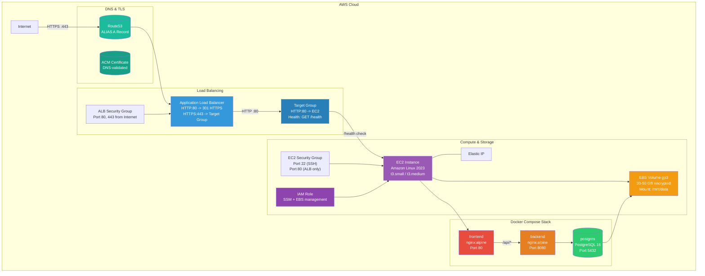

# Architecture Diagram



## Data Flow

```
  1. User --> https://customer.domain.com
  2. Route53 ALIAS resolves to ALB DNS
  3. ALB terminates TLS (ACM cert)
  4. ALB forwards to Target Group (EC2:80)
  5. EC2 SG allows only ALB on port 80
  6. Docker frontend serves /, proxies /api to backend
  7. Backend communicates with PostgreSQL
  8. Postgres persists data to EBS volume
```

## Security Boundaries

| Layer | Controls |
|-------|----------|
| Network | SG restricts SSH, HTTP from ALB only |
| Host | IMDSv2 required, SSH key auth |
| IAM | Instance role with minimal SSM + EBS manage |
| Data | EBS encrypted at rest |
| Application | Containers run as non-root, health checks |
